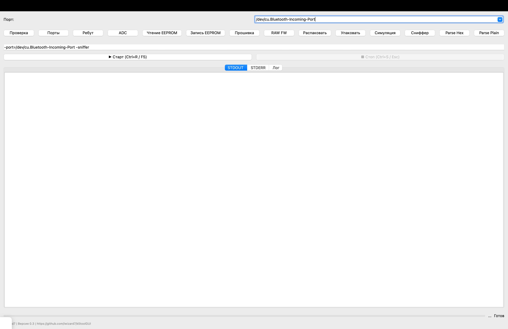

**Графическая оболочка для работы с `k5tool` — мощным CLI-инструментом для взаимодействия с радиомодулями и прошивкой устройств.**

  
🔗 [GitHub репозиторий](https://github.com/iwizard7/k5toolGUI)

---

## 📦 Возможности

- ✅ Поддержка большинства ключевых команд `k5tool`
- 🔌 Ввод и сохранение порта (например, COM3, /dev/ttyUSB0)
- 💬 История команд и автоматическая подстановка предыдущих аргументов
- 🌑 Переключение между тёмной и светлой темой
- 📂 Удобный выбор файлов и директорий
- 🧠 Отображение stdout, stderr и логов отдельно
- ⏱ Прогресс выполнения команды
- 📜 Логирование в файл
- 🛑 Возможность остановки выполняемой команды
- 🖱️ Нажатие на кнопку запускает соответствующую команду
- 🧩 Удобное масштабируемое окно истории команд

---

## 📸 Скриншот



---

## 🚀 Установка

> Требуется Python 3.7+ и `PySide6`

1. Клонируйте репозиторий:
    ```bash
   git clone https://github.com/iwizard7/k5toolGUI.git
   cd k5toolGUI
   ```
2. Убедитесь, что у вас установлен Python 3 и PySide6:
    ```bash
    pip install PySide6
    ```
3. Запустите GUI:
    ```bash
    python k5tool_gui.py
    ```
4. или через скрипт
    ```bash
    chmod +x ./run.sh
    ./run.sh
    ```
5. В меню "Настройки" задайте путь к исполняемому файлу k5tool.